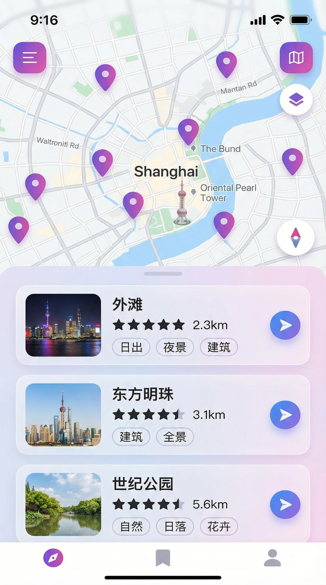

# 微信图片和视频显示问题修复指南

## 问题总结

在微信中访问官网时，图片和视频无法正常显示。经诊断，主要原因是使用了相对路径，而访问的临时域名与资源实际位置不匹配。

## 修复方案

已对官网HTML文件进行以下修复，并推送到GitHub仓库：

### 1. 资源路径修复
将所有资源从相对路径改为绝对路径（GitHub Pages）：

**Logo图片**
- 修复前：`src="kuromi-logo.png"`
- 修复后：`src="https://tsaojason-cao.github.io/yanbao-screenshots-showcase/kuromi-logo.png"`

**视频文件**
- 修复前：`src="assets/yanbao-promo.mp4"`
- 修复后：`src="https://tsaojason-cao.github.io/yanbao-screenshots-showcase/assets/yanbao-promo.mp4"`

**视频封面**
- 修复前：`poster="assets/module-home.webp"`
- 修复后：`poster="https://tsaojason-cao.github.io/yanbao-screenshots-showcase/assets/module-home.webp"`

### 2. 图片格式降级方案
为所有WebP格式的截图添加PNG降级支持，提升老版本微信的兼容性：

```html
<!-- 修复前 -->


<!-- 修复后 -->
<picture>
    <source srcset="https://tsaojason-cao.github.io/yanbao-screenshots-showcase/assets/module-spots.webp" type="image/webp">
    
</picture>
```

涉及的6张图片：
- module-spots.webp（机位推荐）
- module-edit.webp（LUT预设）
- module-gallery.webp（相册）
- module-home.webp（首页）
- module-camera.webp（相机）
- module-settings.webp（设置）

### 3. 微信兼容性配置
HTML中已包含完整的微信浏览器兼容性配置（保持不变）：

```html
<!-- 微信分享配置 -->
<meta property="og:title" content="YanBao AI - 专业摄影 AI智能修图">
<meta property="og:description" content="40个真实机位、12种LUT预设、AI影集生成、一键成片。库洛米主题，让摄影更有趣！">
<meta property="og:image" content="https://tsaojason-cao.github.io/yanbao-screenshots-showcase/assets/logo.png">
<meta property="og:url" content="https://tsaojason-cao.github.io/yanbao-screenshots-showcase/">

<!-- 微信浏览器兼容性 -->
<meta name="format-detection" content="telephone=no">
<meta name="x5-orientation" content="portrait">
<meta name="x5-fullscreen" content="true">
<meta name="x5-page-mode" content="app">

<!-- 视频标签配置 -->
<video 
    controls 
    playsinline 
    webkit-playsinline 
    x5-video-player-type="h5" 
    x5-playsinline="true"
    x5-video-player-fullscreen="true" 
    x5-video-orientation="portrait"
    ...
>
```

## 部署状态

✅ **已完成的操作**：
1. 创建修复脚本 `/home/ubuntu/fix_wechat_paths.py`
2. 执行修复，生成 `index-wechat-fixed.html`
3. 备份原文件为 `index-original-backup.html`
4. 替换原 `index.html` 为修复版本
5. 提交到GitHub：commit `ca5568d`
6. 推送到远程仓库
7. 触发GitHub Pages重新部署：commit `cf9ece1`

⏳ **等待中**：
- GitHub Pages部署通常需要1-3分钟
- CDN缓存刷新可能需要5-10分钟

## 访问地址

**GitHub Pages官方地址**（推荐）：
```
https://tsaojason-cao.github.io/yanbao-screenshots-showcase/
```

这是稳定的生产地址，应该在微信中分享这个链接。

**临时测试地址**（不推荐）：
```
https://8080-i9t9qv28vzb937x6o1wxc-e858d928.sg1.manus.computer/yanbao-website-complete.html
```

临时域名会在沙盒关闭后失效，不适合长期使用。

## 测试建议

修复完成后，建议在以下环境中测试：

1. **微信内置浏览器**
   - iOS微信
   - Android微信
   
2. **测试项目**
   - ✅ Logo图片是否显示
   - ✅ 视频是否能播放
   - ✅ 视频封面是否显示
   - ✅ 6张功能截图是否全部显示
   - ✅ 分享到微信时预览图是否正确

3. **清除缓存**
   - 如果看到旧版本，尝试清除微信缓存
   - 或者在链接后添加时间戳：`?t=20260112`

## 技术细节

### 为什么使用绝对路径？

相对路径依赖于HTML文件的实际位置。当通过不同域名访问时（如临时域名），浏览器会在错误的位置查找资源。使用绝对路径可以确保无论从哪个域名访问，资源都能正确加载。

### 为什么需要PNG降级？

虽然现代微信浏览器支持WebP格式，但部分老版本可能不支持。使用`<picture>`标签可以让浏览器自动选择支持的格式：
- 支持WebP的浏览器会加载WebP（文件更小，加载更快）
- 不支持WebP的浏览器会降级到PNG（兼容性更好）

### GitHub Pages缓存问题

GitHub Pages使用CDN分发内容，更新后可能需要一些时间才能在全球范围内生效。如果立即访问看到的还是旧版本，这是正常现象，等待几分钟即可。

## 文件清单

本次修复涉及的文件：

```
/home/ubuntu/yanbao-screenshots-showcase/
├── index.html                      # 修复后的主文件（已推送）
├── index-original-backup.html      # 原始文件备份
├── index-wechat-fixed.html         # 修复版本（与index.html相同）
└── assets/
    ├── kuromi-logo.png
    ├── yanbao-promo.mp4
    ├── module-*.webp              # WebP格式截图
    └── module-*.png               # PNG格式截图（降级方案）
```

## 后续优化建议

1. **视频优化**
   - 考虑压缩视频文件大小（当前可能较大）
   - 提供多个分辨率版本适配不同网络环境

2. **图片优化**
   - 已使用WebP格式，文件大小已优化
   - PNG降级方案已就位

3. **CDN加速**
   - GitHub Pages已提供CDN
   - 如需更快速度，可考虑使用国内CDN

4. **监控和分析**
   - 添加访问统计（如Google Analytics）
   - 监控加载性能和错误率

## 联系方式

如有问题，请联系：
- GitHub: Tsaojason-cao
- 仓库: https://github.com/Tsaojason-cao/yanbao-screenshots-showcase
